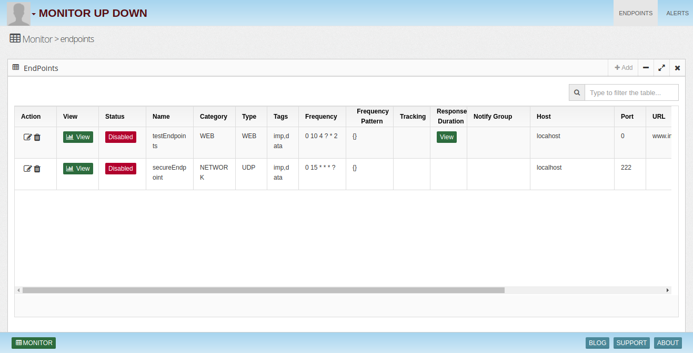
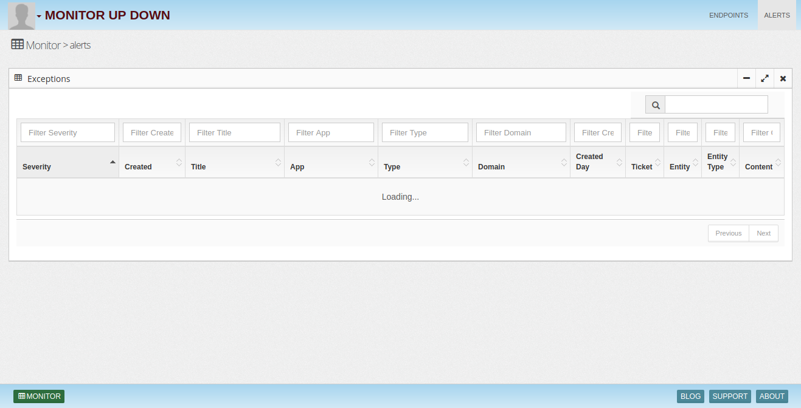

# MonitorUpDown

Companies employ many tools for website, application and system monitoring. Keeping these resources up and maintaining business continuity is very important.

InsightLake Monitor Up Down service uses Big data to monitor large number of different endpoints (websites, applications and systems) in scalable way. It provides features to check uptime and performance. It notifies and invokes actions when an endpoint goes down.

Monitoring uptime and performance improves customer experience.

## Endpoint Monitoring
InsightLake monitoring solutions monitors the endpoints from different geographic locations. Following types of endpoints get monitored:

General - Host (Ping), TCP, UDP
Email - SMTP monitoring of enterprise email servers. Servers can be POP3, IMAP or SMTP
Website - Website performance monitoring
REST - API monitoring

## Alerts
InsightLake monitoring solutions responsible for providing all types of alerts releted to monitoring.

## Website Performance
Website performance measurement includes the following:

Load time
Data size
Type of content - script, fonts, images
How many fetch requests
Geographically Distributed Monitoring
Monitoring solution uses geo distributed clusters to perform testing and enables companies to make their content delivery better.

## Analytics
Endpoint Uptime analytics

What percentage of time system/endpoint is up
Response duration trend
Explore up down events
Website Analytics

Installation
------
* Download or clone the repository. 
* Run bin/insightlake command.
* Open browser with URL as http://localhost:8080/
* Change configuration in /conf folder to set different ports
* By default H2 database is used, you can change the database details in jdbc.properties file

License
------
InsightLake Monitor Up Down is a commercial product but distributed to be used freely. Please contact contact@insightlake.com for details.

Getting Help
----------

You can get help easily :
Community - Google Groups
Slack Channel
Twitter
Facebook
Email: contact@insightlake.com
